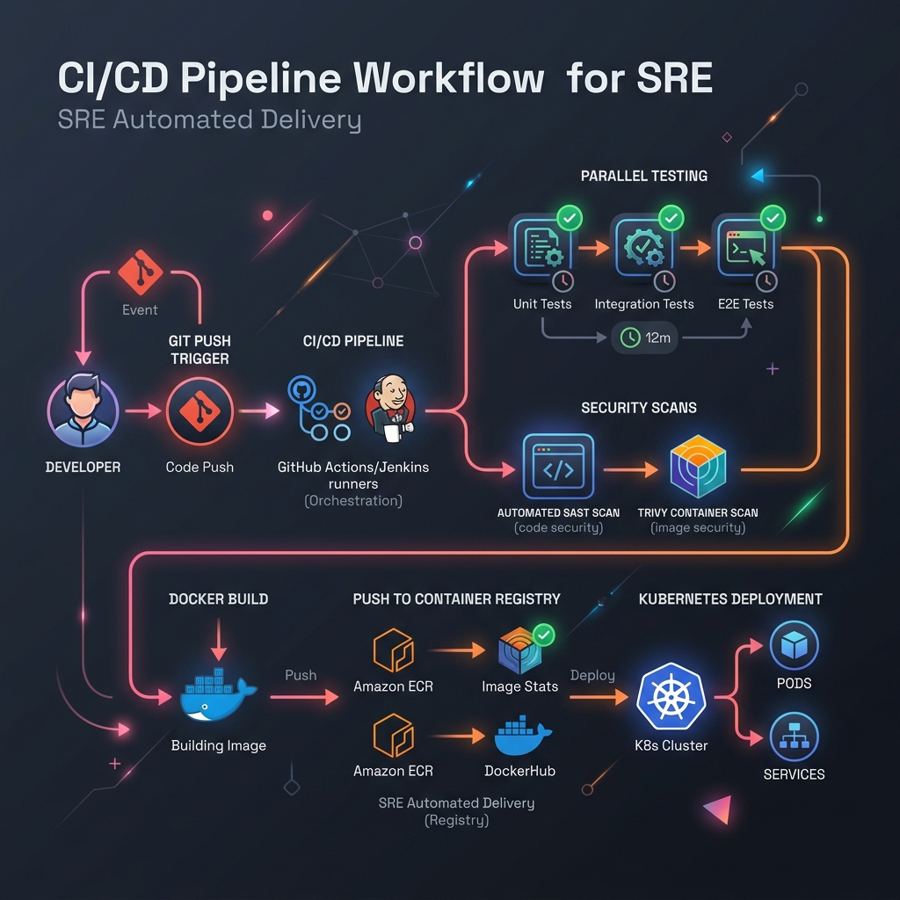

# ⚡ Azure DevOps Pipelines Studio
> Author robust pipeline tasks for Azure DevOps. Generate multi-stage YAML pipelines, agent pool targets, secret library links, and sonarqube scans gates.

[](https://pradeeptalari14.github.io/portfolio/tools/azure-devops-pipelines/)
[]()

---

## 🎛️ How This Studio Works

Author robust pipeline tasks for Azure DevOps. Generate multi-stage YAML pipelines, agent pool targets, secret library links, and sonarqube scans gates.

Open the **[Interactive Studio](${studioUrl})** to configure options and generate files.
Each option combination produces different output — try different settings to learn by example.

## 🏗️ Architecture Flow Diagram



## 🚀 Step-by-Step Onboarding & Validation Guide

Follow these SRE steps to deploy, validate, and monitor this repository's workspace configs in a local or production environment:

#### 1. Prerequisites
- [x] **Git**
- [x] **GitHub CLI (gh)**
- [x] **Docker Engine**
- [x] **Pre-commit environment**

#### 2. Download
Clone this repository locally:
```bash
git clone https://github.com/Pradeeptalari14/tp-azure-devops-pipelines.git
cd tp-azure-devops-pipelines
```

#### 3. Install
Fetch required packages and compile environment binaries:
```bash
pre-commit install || npm install || pip install -r requirements.txt
```

#### 4. Enable Automatic Sidecar Injection
Configure runner-level security scan sidecars (e.g. SonarQube quality gates) to validate artifacts.

#### 5. Install Kubernetes Gateway API CRDs
Configure webhooks gateway endpoints or gateway route components to trigger actions:
```bash
kubectl apply -f https://raw.githubusercontent.com/kubernetes-sigs/gateway-api/v1.1.0/config/crd/standard/gateway-api-v1.1.0-experimental.yaml
```

#### 6. Deploy Application Workload
Commit configurations to push-trigger actions runner execution:
```bash
git add .
git commit -m "ci: deploy automation workflows"
git push origin main
```

#### 7. Validate Application Inside Cluster
Inspect actions pipeline run metrics and exit values:
```bash
gh run list --limit 5 && gh run view
```

#### 8. Expose Application Using Gateway
Expose runner metrics or webhook endpoints using local port proxies or cloud tunnels.

#### 9. Access the Application
Access the actions runner logs and artifacts page at [https://github.com/Pradeeptalari14/tp-azure-devops-pipelines/actions](https://github.com/Pradeeptalari14/tp-azure-devops-pipelines/actions).

#### 10. Install Addons
Integrate Trivy container image scanning, Gitleaks secrets gates, and dependabot configuration managers.

#### 11. Access Dashboard
Access GitHub Actions workflows board, pipeline run console, or Jenkins blue-ocean dashboards.

#### 12. View Service Mesh Graph
Inspect parallel steps execution matrix, job dependency map, and steps duration graphs.

#### 13. Generate Traffic
Manually dispatch run events to evaluate pipeline stability:
```bash
gh workflow run ci-cd.yml
```

#### 14. Project Structure
```text
tp-tp-azure-devops-pipelines/
├── .gitignore                # Version control exclusions
├── LICENSE                   # MIT Open Source License
├── SECURITY.md               # Vulnerability reporting protocols
├── CHANGELOG.md              # Releases version history
├── README.md                 # Project learning guide & onboarding
├── .env.example              # Template parameters config
├── .pre-commit-config.yaml   # Gitleaks & lint pipeline hooks
├── docs/
│   ├── USAGE.md              # Extended developer usage docs
│   ├── TROUBLESHOOTING.md    # Failures resolution guide
│   ├── GLOSSARY.md           # SRE domain terminology index
│   ├── COMPLIANCE.md         # Legal and security checks checklist
│   └── sre_architecture_flow.png # Category SRE architecture diagram
├── scripts/
│   └── validate.sh           # Local validation helper script
└── .github/
    ├── CONTRIBUTING.md       # Contributing instructions
    ├── PULL_REQUEST_TEMPLATE.md # Pull request code compliance check
    ├── ISSUE_TEMPLATE/       # Bug and features tickets
    ├── dependabot.yml        # Auto updates dependencies
    └── workflows/
        └── security-scan.yml # Gitleaks/yamllint/shellcheck scans

# Primary Config File: azure-pipelines.yml
```

#### 15. Observability Components
Monitors workflows execution times, failure frequencies, security CVE statistics, and linter warnings.

#### 16. Install Monitoring
Triggers instant alerts (Slack, PagerDuty) on workflow failures or credentials leak detection.

## 🔐 Security

- ❌ Never commit real credentials
- ✅ Use environment variables or secret managers
- ✅ Enable branch protection on `main`

## 📖 Resources

| Resource | Link |
|----------|------|
| Interactive Studio | [Open →](https://pradeeptalari14.github.io/portfolio/tools/azure-devops-pipelines/) |
| All 91 Studios | [Dashboard →](https://pradeeptalari14.github.io/portfolio/tools/) |

*Part of [Talari Pradeep Developer Studio Portfolio](https://pradeeptalari14.github.io/portfolio)*